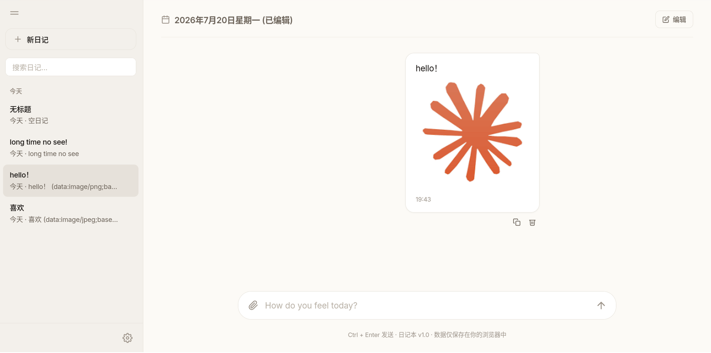
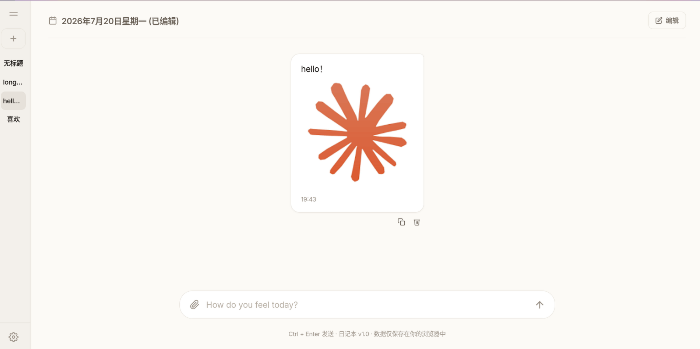

# 日记本 📔

一个 Claude 风格的本地日记应用。纯 HTML/CSS/JS，无需任何环境，双击即用。

## ✨ 特性

- **Claude 风格 UI** — 对话气泡式日记流，每次发送生成一条气泡
- **Markdown 支持** — 标题、列表、引用、代码块、**图片**
- **离线优先** — 所有数据保存在浏览器 localStorage，无需联网
- **日期分组** — 日记按 今天 / 昨天 / 本周 / 本月 / 更早 自动分类
- **搜索日记** — 按关键词实时搜索
- **导入导出** — JSON 格式备份，一键恢复
- **PWA 支持** — 可安装到桌面/手机主屏，像原生 App 一样运行
- **AI 接口预留** — `callAI()` 函数已就位，接入 Claude API 只需改一行代码
- **响应式设计** — 电脑、平板、手机全适配

## 🚀 使用方式

### 本地使用
直接双击 `index.html`，或：
```bash
npx serve .
```

### 部署到 Vercel
```bash
npm i -g vercel
vercel --prod
```

## 📸 界面





## 🎨 设计参考

本项目的 UI 设计受到以下作品的启发：

- **[Claude](https://claude.ai)** — Anthropic 的 AI 助手，提供了主要的视觉设计方向
- **[NextChat](https://github.com/ChatGPTNextWeb/NextChat)** — 开源聊天应用，其 CSS 设计令牌模式和 Modal 系统值得学习

本项目代码为原创实现，未使用上述项目的任何源代码。

## 📄 许可

MIT License
